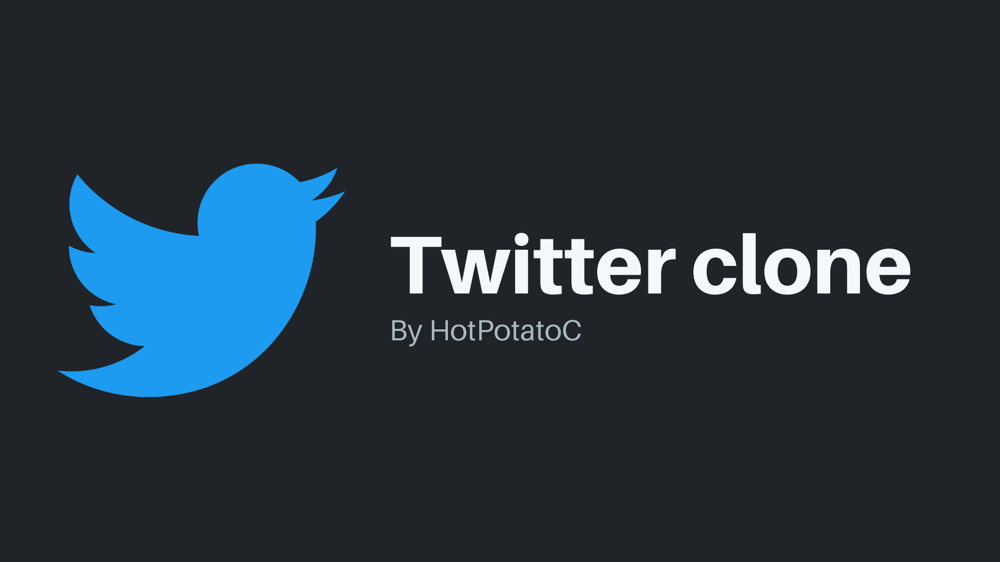

# Twitter clone

> A Twitter clone created with Golang, PostgreSQL, Redis, VueJS and Vite with support for dark mode and light mode using TailwindCSS

# Features ✨

- Modular Architecture
- Database migration tool using [migrate](https://github.com/golang-migrate/migrate)
- Database seeding script using NodeJS
- Authentication using JWT Refresh token flow and Redis for token blacklisting
- Strongly typed Vuex store
- List Tweets feed
- Create Tweets with images
- Reply to Tweets or reply to another reply!
- Like Tweets
- Follow users
- Images & Media uploads stored in AWS S3 Buckets
- Edit Profile Details
- Edit Profile Image
- See who a user is following and see their followers

# Tech 🛠

- [Golang](golang.org)
- [Fiber HTTP framework](https://github.com/gofiber/fiber)
- [PostgreSQL](postgresql.org)
- [Redis](redis.io)
- [migrate](https://github.com/golang-migrate/migrate)
- [NodeJS](https://nodejs.org/en/)
- [Amazon Web Service S3](https://aws.amazon.com/s3/)
- [TypeScript](https://www.typescriptlang.org/)
- [Vue 3](https://v3.vuejs.org/)
- [Vite 2.0](https://vitejs.dev/)
- [Vuex 4](https://next.vuex.vuejs.org)
- [Vue Router 4](https://next.router.vuejs.org)
- [TailwindCSS](http://tailwindcs.com/)

# Installation - Running locally 💻

> NOTE: To run this app locally you need to have an AWS S3 Bucket available so that uploading images will work. At the time im writing this I'm using an account provided by AWS educate which is an available option for students or you can start a free trial if you have a credit card.

1. **Clone the repository**

```sh
❯ git clone https://github.com/HotPotatoC/twitter-clone.git

❯ cd twitter-clone
```

2. **Create .env file in `configs/` directory by copying `configs/.env.example` and setup the environment variables**

3. **Create the PostgreSQL database and run migrations**

> To run the migrations first install the **migrate** tool [here](https://github.com/golang-migrate/migrate/tree/master/cmd/migrate)

```sh
❯ createdb twitterclone

❯ ./scripts/run_migrations.sh Your_PostgreSQL_URL
```

4. **Run the backend server**

```sh
❯ go run cmd/rest/main.go --prefork
```

5. **On another terminal tab setup the frontend**

```sh
❯ cd web

# Using yarn to install the dependencies
❯ yarn

# Using npm to install the dependencies
❯ npm install
```

6. **Run the frontend**

```sh
❯ yarn dev

# Or from the root of the project
❯ yarn web-dev
```

And there you go!

# Resources & references used

- https://twitter.com
- https://about.twitter.com/en/who-we-are/brand-toolkit
- https://github.com/shuber/postgres-twitter
- [Build a twitter clone using vue.js and tailwind css! (by: this.stephie)](https://www.youtube.com/watch?v=bQU-jPyQJ4A)
- [Is SELECT * Expensive? (by: Hussein Nasser)](https://www.youtube.com/watch?v=QQVNVOneZNg)
- [SELECT COUNT (*) can impact your Backend Application Performance, here is why (by: Hussein Nasser)](https://www.youtube.com/watch?v=8xKS7QQKgzk)
- [Full Text Search PostgreSQL (by: Ben Awad)](https://www.youtube.com/watch?v=szfUbzsKvtE)
- https://www.postgresql.org/message-id/20050810133157.GA46247@winnie.fuhr.org
- https://dev.to/shubhadip/vue-3-vuex-4-modules-typescript-2i2o
- https://dev.to/3vilarthas/vuex-typescript-m4j

# Todo

SS = Server Side
CS = Client Side

- [x] Create reply (CS)
- [x] Logout (CS)
- [x] Favorite tweet (CS)
- [x] Profile View (CS)
- [x] Only see followed user Tweets in the feed (SS & CS)
- [x] Avatar image (SS & CS)
  - [x] Update profile image (SS)
  - [x] Update profile image (CS)
  - [x] Crop image (CS)
- [x] Lazy load images (CS)
- [ ] Attach an image to a Tweet (SS & CS)
  - [x] Attach multiple images in a tweet (SS)
  - [x] Attach multiple images in a tweet (CS)
  - [x] Overlay image display and side panel (CS)
  - [ ] Overlay image side panel replies (CS)
- [x] 'Replying to ...' design Tweet card (CS)
- [ ] List profile followers and followings (CS)
- [x] Support for link parsing on Tweet's content (CS)
- [ ] Retweets (SS & CS)
- [ ] Profile Tweets & replies tab (CS)
- [ ] List user likes / Profile likes tab (SS & CS)
- [ ] Profile media tab (CS)
- [ ] Pagination on search results (SS)
- [ ] Toggle dark mode and light mode (CS)

# Improvements (?)

- [ ] Tweet threads
- [ ] Hashtags and mentions
- [ ] Notifications with Redis pubsub & websockets
- [ ] Bookmarks
- [ ] Lists
- [ ] Trending section

# Disclaimer

`twitter-clone` is created for educational purposes only.

I do not work for Twitter nor Twitter the company itself has any associations / involvements in this project.